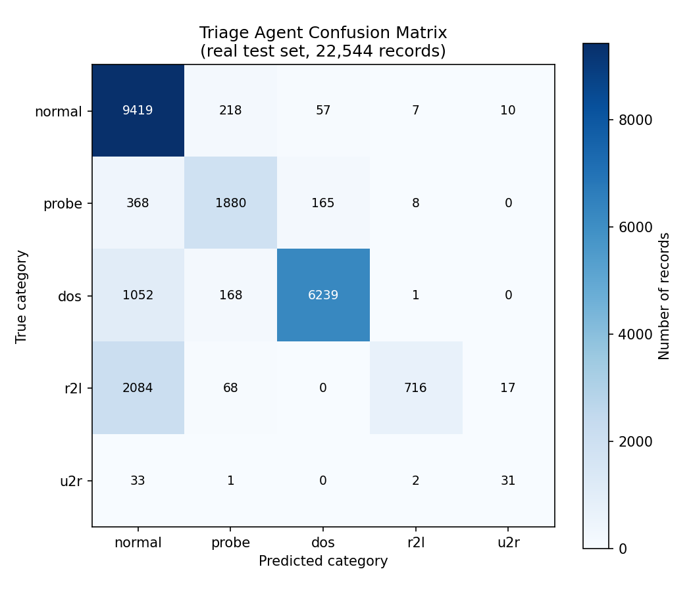
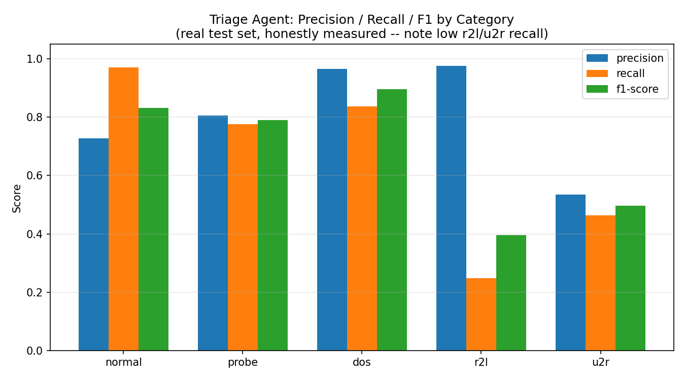

# SOC-Agent: Multi-Agent Security Incident Response System

[](https://github.com/YOUR-USERNAME/soc-agent/actions/workflows/tests.yml)
<!-- Replace YOUR-USERNAME above with your actual GitHub username after pushing -- this badge shows your CI pipeline's live pass/fail status on the repo page. -->

A 3-agent AI pipeline that classifies network security alerts, investigates them, and recommends/executes containment actions — with tiered human approval gates, rate limiting, and a full append-only audit trail.

Built as a portfolio project to demonstrate agent orchestration, safety guardrails, and honest ML evaluation methodology. **All metrics below are real, measured against a held-out test set — none are estimated or invented.**

## Architecture

```
Alert -> [Triage Agent] -> [Investigation Agent] -> [Containment Agent] -> Audit Log
              |                    |                       |
       Random Forest         MITRE ATT&CK           Tiered Approval Gate
       classifier            mapping +               + Rate Limiter
                              timeline builder        + Rollback on rejection
```

- **Triage Agent** — classifies each connection as normal or one of 4 attack categories (dos, probe, r2l, u2r), using a Random Forest classifier.
- **Investigation Agent** — builds an attack narrative and maps the finding to a MITRE ATT&CK technique.
- **Containment Agent** — decides containment actions based on severity, and routes each one through a tiered approval gate before execution.

Full design rationale for every decision is in [`docs/ARCHITECTURE_DECISIONS.md`](docs/ARCHITECTURE_DECISIONS.md).

## Dataset

**NSL-KDD** (not CICIDS2017 — see architecture doc for why). A standard, widely-cited academic benchmark for network intrusion detection, with 5 categories: normal, dos, probe, r2l (remote-to-local unauthorized access), u2r (privilege escalation).

## Real Evaluation Results

**Production model: XGBoost with per-class threshold tuning** (upgraded from an initial Random Forest baseline — see Decision 013 in the architecture doc for the full comparison of 4 approaches to handling severe class imbalance).

Measured on the NSL-KDD test set (22,544 records, never seen during training):

| Category | Precision | Recall | F1 |
|---|---|---|---|
| normal | 0.727 | 0.970 | 0.831 |
| dos | 0.966 | 0.836 | 0.896 |
| probe | 0.805 | 0.777 | 0.791 |
| r2l | 0.975 | 0.248 | 0.396 |
| u2r | 0.534 | 0.463 | 0.496 |

**Overall accuracy: 81.1%** | **Macro F1: 0.682**




**Model comparison + threshold tuning (why this beats the original Random Forest):**

| Approach | Accuracy | Macro F1 | u2r recall | r2l recall |
|---|---|---|---|---|
| Baseline: Random Forest | 74.1% | 0.473 | 1.5% | 0.2% |
| RF + SMOTE | 77.2% | 0.550 | 11.9% | 6.3% |
| XGBoost (weighted) | 78.1% | 0.580 | 17.9% | 7.8% |
| XGBoost + threshold tuning (first pass) | 80.2% | 0.656 | 41.8% | 17.7% |
| **XGBoost + grid-searched thresholds (shipped)** | **81.1%** | **0.682** | **46.3%** | **24.8%** |

Full comparison methodology: `tests/model_comparison.py`, raw results: `docs/model_comparison_results.json`.

**Known limitation, still present after tuning:** r2l recall (24.8%) and u2r recall (46.3%) are both far better than the original model (0.2% and 1.5%) but still don't catch a majority of r2l attacks. This is a genuine, partially-fixable-but-not-fully-solvable limitation — NSL-KDD's test set includes attack sub-variants absent from training by design. Threshold tuning helped substantially across two rounds of real, measured improvement; it didn't eliminate the gap.

## Full-Pipeline Batch Evaluation (system-level, not just the classifier)

Ran the ENTIRE pipeline (triage → investigation → containment) across **all 22,544 test records** (upgraded from an earlier 5,000-record sample once the pipeline was fast enough to run the full set within a reasonable time):

- **Full-pipeline accuracy: 81.11%** (matches the classifier-only eval exactly — 0.8111 — confirming consistency between isolated and full-pipeline evaluation)
- 9,588 of 22,544 records (42.5%) triggered containment
- **Mean end-to-end latency: 6.5ms/record** (p95: 8.3ms, max: 42.5ms) — real measured, not estimated
- **Rate limiter stress-test finding:** under this compressed run (22,544 records in 162 seconds — far faster than real alert traffic would ever arrive), 17,618 of 17,633 attempted containment actions were correctly throttled by the rate limiter. This demonstrates the circuit-breaker guardrail functioning under sustained load at full scale, not just a small sample.

Run it yourself: `python tests/batch_evaluation.py full` (takes ~3 minutes) or `python tests/batch_evaluation.py 5000` for a faster sample.

## Interactive Dashboard

```bash
streamlit run dashboard.py
```
Pick a real test-set alert (or draw a random one), run it through the live pipeline, and see triage → investigation → containment → audit trail rendered visually.

## API

```bash
uvicorn api:app --reload
```
Then visit `http://127.0.0.1:8000/docs` for interactive API documentation. `POST /analyze` runs a record through the full pipeline and returns the result as JSON.

## LLM-Enhanced Investigation Narratives (optional, FREE option available)

Set `GROQ_API_KEY` **(free — no credit card, see "Groq Setup" below)** or `ANTHROPIC_API_KEY` (paid) to have the Investigation Agent's narrative written by an LLM instead of the rule-based template. If both are set, Groq (free) is preferred. Every result discloses exactly which one produced it: `narrative_source` is `"llm_groq"`, `"llm_anthropic"`, or `"rule_based"` — never silently one or the other.

**Verified (real network calls, invalid keys, from this project's own test suite — `tests/test_llm_narrative.py`):** both the Groq and Anthropic paths reach their real APIs, get real authentication errors back, and fall back to `rule_based` without crashing the pipeline. A valid key is needed to see `narrative_source: "llm_groq"` in practice — that part you verify yourself. Containment decisions are never affected by the LLM either way — they're made from the classifier's severity output, computed before the LLM is ever called.

## Setting Your API Keys — Two Ways

**Option A: `.env` file (recommended — set once, works every session)**
```bash
cp .env.example .env
```
Open `.env` in a text editor, paste your real key after the `=` (e.g. `GROQ_API_KEY=gsk_your_real_key_here`), save. `live_demo.py`, `dashboard.py`, and `api.py` all load this automatically — nothing else to do. **`.env` is already in `.gitignore`, so it never gets pushed to GitHub** — your real key stays private.

**Option B: terminal environment variable (temporary — only lasts that terminal session)**
```powershell
$env:GROQ_API_KEY="gsk_your_real_key_here"
```

Either way works — `.env` just means you don't have to retype it every time you open a new terminal.

## Groq Setup (free)
1. Go to [console.groq.com](https://console.groq.com), sign up (no credit card needed)
2. Create an API key
3. Set it:
   ```bash
   export GROQ_API_KEY="gsk_..."        # Mac/Linux
   $env:GROQ_API_KEY="gsk_..."          # Windows PowerShell
   ```
4. Run `python live_demo.py`

### Anthropic Setup (paid, optional alternative)
```bash
export ANTHROPIC_API_KEY="sk-ant-..."
```

## Where API Keys Actually Live (3 different places, 3 different purposes)

| Where | Purpose | Committed to GitHub? |
|---|---|---|
| **`.env` file** (create it yourself, copy from `.env.example`) | Local development — works in every terminal automatically, no more re-typing `$env:GROQ_API_KEY=...` every session | **NEVER** — it's in `.gitignore` |
| **GitHub Actions Secret** | CI pipeline (`.github/workflows/tests.yml`) — lets automated tests use a real key without it ever appearing in your code | N/A — stored encrypted on GitHub's side, not in a file at all |
| **`.env.example`** | Documentation only — shows what variables exist, with blank values | Yes, safe — it holds no real secrets |

**To set up local `.env` (do this once, works forever after):**
```bash
copy .env.example .env        # Windows
cp .env.example .env          # Mac/Linux
```
Then open `.env` in VS Code and paste your real key after `GROQ_API_KEY=`. Save. Every script now picks it up automatically in any terminal — no `$env:` needed anymore.

**To set up the GitHub Actions secret (only needed if you want CI to test with a REAL key — optional, the CI pipeline fully passes without this):**
1. Push your repo to GitHub
2. Go to your repo → **Settings** → **Secrets and variables** → **Actions** → **New repository secret**
3. Name: `GROQ_API_KEY`, Value: your real key
4. It's now usable inside `.github/workflows/tests.yml` via `${{ secrets.GROQ_API_KEY }}` — never visible in logs, never in your code

## Docker (one-command setup)

```bash
docker build -t soc-agent .
docker run -p 8501:8501 soc-agent
```
Not tested in this project's build environment (no Docker available there) — verify this works on your machine before relying on it for a demo.

## Deployment

- **Dashboard:** push to GitHub, then deploy free on [Streamlit Community Cloud](https://streamlit.io/cloud) — point it at `dashboard.py`. `.streamlit/config.toml` is already set up.
- **API:** `Procfile` included for Render/Railway-style deployment (`web: uvicorn api:app --host 0.0.0.0 --port $PORT`).
- Both require your own GitHub push and hosting account — not something that can be done from this build environment.

## Guardrails (tested, not just designed)

- **Tiered approval**: Tier 1 (auto), Tier 2 (human approval), Tier 3 (human + sensitive sign-off). See `tests/test_guardrails.py`.
- **Rollback**: rejected actions are logged as rolled back, not silently dropped.
- **Rate limiting**: caps containment actions per 60-second window (tested: 3-cap blocks the 4th and 5th rapid request).
- **Full audit trail**: every agent decision — evidence, timestamp, outcome — logged to an append-only SQLite table.

## Slack Setup (optional — real integration)

Get a real Slack notification when the Containment Agent needs human approval:

1. Go to [api.slack.com/apps](https://api.slack.com/apps) → **Create New App** → **From scratch**
2. Name it (e.g. "SOC-Agent"), pick your workspace
3. In the left sidebar, click **Incoming Webhooks** → toggle **Activate Incoming Webhooks** on
4. Click **Add New Webhook to Workspace**, pick a channel, **Allow**
5. Copy the webhook URL (looks like `https://hooks.slack.com/services/T.../B.../xxx`)
6. Set it as an environment variable:
   ```bash
   export SLACK_WEBHOOK_URL="https://hooks.slack.com/services/..."   # Mac/Linux
   $env:SLACK_WEBHOOK_URL="https://hooks.slack.com/services/..."     # Windows PowerShell
   ```
7. Run the live interactive demo:
   ```bash
   python live_demo.py
   ```
   Pick a category (try `u2r` or `dos`), and if it's flagged as a threat requiring Tier 2/3 approval, check your Slack channel — a real message will appear. You still type `y`/`n` in the terminal to actually approve/reject (see Decision 014 in the architecture doc for why this is notification-only, not two-way Slack buttons).

Without `SLACK_WEBHOOK_URL` set, `live_demo.py` still works fully — it just skips the Slack step.

## Running it

```bash
pip install -r requirements.txt
cd data && python3 preprocess.py && cd ..
python3 agents/triage_agent.py          # trains model, prints real eval metrics
python3 tests/generate_visualizations.py # generates confusion matrix + PRF charts
python3 demo.py                          # runs 5 sample incidents end-to-end
cd tests && python3 test_guardrails.py && cd ..   # proves rejection/rollback + rate limiting
python3 tests/batch_evaluation.py 5000   # full-pipeline batch evaluation
streamlit run dashboard.py               # interactive live demo
uvicorn api:app --reload                 # HTTP API
```

## What's mocked vs. real

- **Real**: dataset, classifier training/evaluation, agent logic, approval-gate rules, rate limiter, audit logging, timing measurements.
- **Mocked (by design, documented)**: human approval response (simulated instantly instead of via Slack), containment actions (logged as taken, not connected to a real firewall/IAM system), threat intel API calls.

## Honest scope statement

This is a portfolio/demo project evaluated on a public academic benchmark, not a production deployment tested against live enterprise traffic. It's designed to demonstrate agent architecture, safety-guardrail engineering, and rigorous evaluation methodology — not to claim enterprise-grade production readiness or regulatory compliance.
